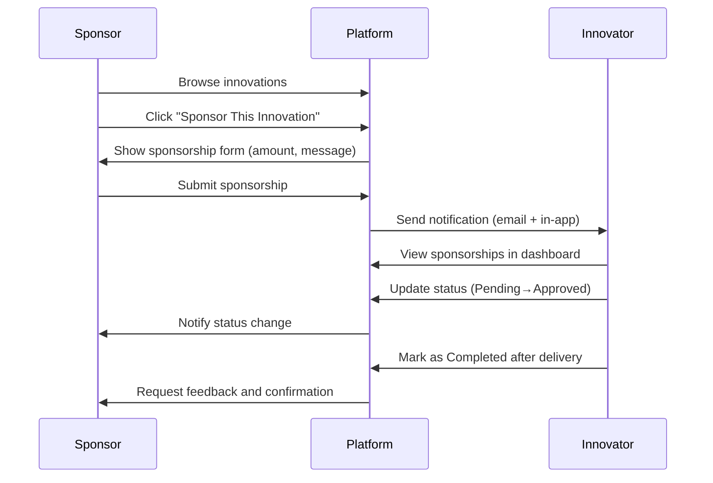
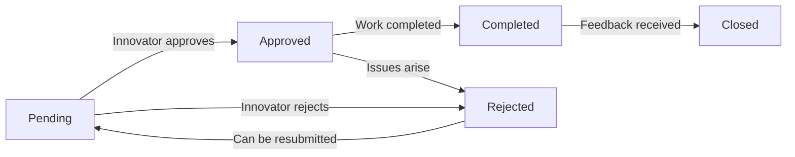

# 🌟 Innovation Trading Center Platform
## *Connecting Ethiopian Innovators with Global Opportunities*


<div align="center">
  
  <p><em>"Innovation distinguishes between a leader and a follower."</em> — Steve Jobs</p>
</div>

---

## 📋 Table of Contents
- [✨ Overview](#-overview)
- [🚀 Features](#-features)
- [⚙️ Technologies](#️-technologies)
- [📁 Project Structure](#-project-structure)
- [🔧 Setup & Installation](#-setup--installation)
- [🔐 Default Credentials](#-default-credentials)
- [👥 User Roles & Permissions](#-user-roles--permissions)
- [💡 Innovation Sponsorship Workflow](#-innovation-sponsorship-workflow)
- [🛡️ Security Considerations](#️-security-considerations)
- [🚀 Future Enhancements](#-future-enhancements)
- [🤝 Contributing](#-contributing)
- [📜 License](#-license)
- [👥 Team](#-team)

---

## ✨ Overview

The **Innovation Trading Center Platform** is a modern web application designed to bridge the gap between Ethiopian innovators and global sponsors/investors. Built with a custom **PHP MVC architecture**, this platform empowers innovators to showcase their groundbreaking ideas while providing sponsors with a streamlined way to discover, evaluate, and support promising innovations.

This platform is more than just a marketplace—it's a catalyst for Ethiopia's innovation ecosystem, fostering collaboration, economic growth, and technological advancement across the continent.

---

## 🚀 Features

### 🔐 Authentication & Authorization
- **Multi-role system**: Innovator, Sponsor/Investor, and Admin roles
- **Secure registration and login** with password hashing
- **Role-based access control** (RBAC) for all features
- **Session management** with secure cookies

### 💡 Innovation Management
- **Innovation posting** with rich media support
- **Full CRUD operations** for innovation management
- **Category and tagging system** for easy discovery
- **Search and filtering** by category, status, and date
- **Innovation status tracking** (Draft, Published, Archived)

### 💰 Sponsorship System
- **One-click sponsorship** with "Sponsor This Innovation" button
- **Sponsorship tracking** for innovators to monitor their projects
- **Status management** (Pending, Approved, Completed, Rejected)
- **Sponsorship history** with detailed records
- **Real-time notifications** for sponsorship updates

### 💬 Communication & Collaboration
- **User-to-user messaging** for direct communication
- **User-to-admin support** tickets
- **Real-time chat** for immediate collaboration
- **Notification system** for important updates
- **Message threading** for organized conversations

### 🎨 User Experience
- **Modern, responsive UI** built with Bootstrap 5
- **Dark/light mode** support
- **Dashboard analytics** for all user roles
- **Favorites system** for bookmarking innovations
- **Progress tracking** for sponsored innovations
- **Mobile-first design** for accessibility across devices

---

## ⚙️ Technologies

<div align="center">
  
| Category | Technologies |
|----------|--------------|
| **Backend** | PHP 8.1+, Custom MVC Framework |
| **Database** | MySQL 8.0+ / MariaDB |
| **Frontend** | Bootstrap 5, Vanilla JavaScript |
| **Security** | Password hashing, CSRF protection, XSS filtering |
| **Deployment** | Apache/Nginx, PHP-FPM |
| **Development** | Composer, Git, VS Code |

</div>

---

## 📁 Project Structure

```
innovation-trading-center/
├── 🧠 app/                     # Core MVC application
│   ├── 🎮 controllers/        # Application controllers
│   │   ├── AuthController.php
│   │   ├── InnovationController.php
│   │   ├── SponsorshipController.php
│   │   ├── MessageController.php
│   │   └── AdminController.php
│   ├── 📊 models/             # Data models
│   │   ├── User.php
│   │   ├── Innovation.php
│   │   ├── Sponsorship.php
│   │   └── Message.php
│   └── 👁️ views/             # UI templates
│       ├── auth/
│       ├── innovations/
│       ├── sponsorships/
│       ├── messages/
│       ├── dashboard/
│       └── layouts/
├── 🌐 public/                  # Web root (optional)
│   ├── 🌐 index.php           # Main entry point/router
│   ├── 📁 assets/             # Public assets
│   └── 📁 uploads/            # Uploaded files
├── 🎨 bootstrap/               # Local Bootstrap assets
│   ├── css/
│   ├── js/
│   └── img/
├── ⚙️ config/                  # Configuration files
│   ├── database.php           # Database configuration
│   ├── routes.php             # Routing configuration
│   └── schema.sql             # Database schema
├── 📊 data/                    # Application data
├── 📝 logs/                    # Log files
├── 🧪 tests/                   # Unit and integration tests
├── 📄 .env.example            # Environment variables template
├── 📄 composer.json           # PHP dependencies
├── 📄 README.md               # Project documentation
└── 📄 TODO.md                 # Development roadmap
```

---

## 🔧 Setup & Installation

### Prerequisites
- **PHP 8.1+** with required extensions (PDO, MySQLi, mbstring, json)
- **MySQL 8.0+** or **MariaDB 10.5+**
- **Composer** for PHP dependency management
- **Web Server** (Apache or Nginx recommended for production)

### Step-by-Step Installation

1. **Clone the repository:**
   ```bash
   git clone https://github.com/ethcocoder/innovation-trading-center.git
   cd innovation-trading-center
   ```

2. **Install PHP dependencies:**
   ```bash
   composer install
   ```

3. **Configure the database:**
   - Create a MySQL database:
     ```sql
     CREATE DATABASE inotrade CHARACTER SET utf8mb4 COLLATE utf8mb4_unicode_ci;
     ```
   - Import the database schema:
     ```bash
     mysql -u your_username -p inotrade < config/schema.sql
     ```
   - Create the sponsorships table (if not included in schema.sql):
     ```sql
     CREATE TABLE sponsorships (
         id INT AUTO_INCREMENT PRIMARY KEY,
         sponsor_id INT NOT NULL,
         innovation_id INT NOT NULL,
         amount DECIMAL(12,2) DEFAULT NULL,
         status VARCHAR(50) DEFAULT 'pending',
         created_at DATETIME DEFAULT CURRENT_TIMESTAMP,
         updated_at DATETIME DEFAULT CURRENT_TIMESTAMP ON UPDATE CURRENT_TIMESTAMP,
         FOREIGN KEY (sponsor_id) REFERENCES users(id),
         FOREIGN KEY (innovation_id) REFERENCES innovations(id)
     );
     ```
   - Configure database credentials in `config/database.php`:
     ```php
     return [
         'host' => 'localhost',
         'database' => 'inotrade',
         'username' => 'your_db_username',
         'password' => 'your_db_password',
         'charset' => 'utf8mb4'
     ];
     ```

4. **Set up file permissions:**
   ```bash
   chmod -R 755 bootstrap/
   chmod -R 755 uploads/
   chmod 644 config/database.php
   ```

5. **Run the development server:**
   ```bash
   # From project root
   php -S localhost:8000
   
   # OR from public directory (if using public/ as web root)
   cd public
   php -S localhost:8000
   ```

6. **Access the application:**
   Open your browser and navigate to:
   ```
   http://localhost:8000
   ```

---

## 🔐 Default Credentials

### Administrator Account
| Field | Value |
|-------|-------|
| **Email** | `admin@innovationcenter.et` |
| **Password** | `admin123` |

> **⚠️ Security Note**: Change the default admin password immediately after first login. For production environments, create additional admin accounts and disable or remove the default account.

### Test Accounts (After Setup)
- **Innovator Account**: Register as a new innovator during setup
- **Sponsor Account**: Register as a new sponsor during setup

---

## 👥 User Roles & Permissions

| Role | Permissions | Key Features |
|------|-------------|--------------|
| **👑 Admin** | Full system access | User management, content moderation, analytics dashboard, system configuration |
| **💡 Innovator** | Limited CRUD access | Post innovations, manage own innovations, view sponsorships, update sponsorship status, messaging |
| **💰 Sponsor** | Read & sponsor access | Browse innovations, sponsor innovations, view sponsorship history, messaging |

### Permission Matrix

| Feature | Admin | Innovator | Sponsor |
|---------|-------|-----------|---------|
| **User Management** | ✅ Full | ❌ No access | ❌ No access |
| **Post Innovation** | ✅ Full | ✅ Own only | ❌ No access |
| **Edit Innovation** | ✅ All | ✅ Own only | ❌ No access |
| **Delete Innovation** | ✅ All | ✅ Own only | ❌ No access |
| **Sponsor Innovation** | ✅ All | ❌ No access | ✅ All |
| **Update Sponsorship Status** | ✅ All | ✅ Own only | ❌ No access |
| **Send Messages** | ✅ All users | ✅ Limited | ✅ Limited |
| **View Analytics** | ✅ Full dashboard | ✅ Personal stats | ✅ Personal stats |

---

## 💡 Innovation Sponsorship Workflow



### Sponsorship Status Flow


---

## 🛡️ Security Considerations

### Security Features Implemented
- **Password Hashing**: bcrypt algorithm with salt for all user passwords
- **Input Validation**: Server-side validation and sanitization for all user inputs
- **CSRF Protection**: Token-based protection for all forms and sensitive operations
- **XSS Prevention**: Output escaping and content security policies
- **SQL Injection Protection**: Prepared statements with parameterized queries
- **Session Security**: Regenerated session IDs, secure cookies, and timeout management
- **File Upload Security**: Type validation, size limits, and storage outside web root

### Production Security Recommendations
```php
// Example security configuration recommendations
// Add to your production config file

// Force HTTPS
if (!isset($_SERVER['HTTPS']) || $_SERVER['HTTPS'] !== 'on') {
    header('Location: https://' . $_SERVER['HTTP_HOST'] . $_SERVER['REQUEST_URI']);
    exit;
}

// Set secure session parameters
ini_set('session.cookie_secure', 1);
ini_set('session.cookie_httponly', 1);
ini_set('session.cookie_samesite', 'Strict');

// Content Security Policy
header("Content-Security-Policy: default-src 'self'; script-src 'self' 'unsafe-inline' https://cdn.jsdelivr.net; style-src 'self' 'unsafe-inline' https://cdn.jsdelivr.net; img-src 'self' data: https://*; font-src 'self' https://cdn.jsdelivr.net;");
```

---

## 🚀 Future Enhancements

### Short-Term Roadmap (Next 3 Months)
| Feature | Priority | Description |
|---------|----------|-------------|
| **📱 Mobile App** | ⭐⭐⭐⭐⭐ | React Native app for iOS and Android |
| **📧 Email Notifications** | ⭐⭐⭐⭐ | SMTP integration with templates |
| **📊 Advanced Analytics** | ⭐⭐⭐⭐ | Innovation performance metrics |
| **🌍 Multi-language Support** | ⭐⭐⭐ | Amharic and English localization |
| **💳 Payment Integration** | ⭐⭐⭐⭐⭐ | Stripe/PayPal for direct payments |

### Long-Term Vision (6+ Months)
| Feature | Priority | Description |
|---------|----------|-------------|
| **🤖 AI Recommendations** | ⭐⭐⭐⭐ | Match sponsors with relevant innovations |
| **📈 Investment Tracking** | ⭐⭐⭐⭐ | ROI tracking for sponsors |
| **🌐 API Integration** | ⭐⭐⭐ | REST API for third-party integrations |
| **🔍 Advanced Search** | ⭐⭐⭐⭐ | Natural language processing search |
| **🤝 Community Features** | ⭐⭐⭐⭐ | Forums, events, and collaboration tools |

---

## 🤝 Contributing

We welcome contributions to the Innovation Trading Center Platform! To contribute:

1. **Fork** the repository on GitHub
2. Create a new **feature branch** (`git checkout -b feature/your-feature`)
3. **Commit** your changes (`git commit -am 'Add some feature'`)
4. **Push** to the branch (`git push origin feature/your-feature`)
5. Create a **Pull Request** with detailed description of changes

### Contribution Guidelines
- Follow PSR-12 coding standards
- Write meaningful commit messages
- Include tests for new features
- Document any new functionality
- Respect the existing code architecture

---

## 📜 License

This project is licensed under the MIT License - see the [LICENSE](LICENSE) file for details.

```
MIT License

Copyright (c) 2025 Ethco Coders

Permission is hereby granted, free of charge, to any person obtaining a copy
of this software and associated documentation files (the "Software"), to deal
in the Software without restriction, including without limitation the rights
to use, copy, modify, merge, publish, distribute, sublicense, and/or sell
copies of the Software, and to permit persons to whom the Software is
furnished to do so, subject to the following conditions:

The above copyright notice and this permission notice shall be included in all
copies or substantial portions of the Software.

THE SOFTWARE IS PROVIDED "AS IS", WITHOUT WARRANTY OF ANY KIND, EXPRESS OR
IMPLIED, INCLUDING BUT NOT LIMITED TO THE WARRANTIES OF MERCHANTABILITY,
FITNESS FOR A PARTICULAR PURPOSE AND NONINFRINGEMENT. IN NO EVENT SHALL THE
AUTHORS OR COPYRIGHT HOLDERS BE LIABLE FOR ANY CLAIM, DAMAGES OR OTHER
LIABILITY, WHETHER IN AN ACTION OF CONTRACT, TORT OR OTHERWISE, ARISING FROM,
OUT OF OR IN CONNECTION WITH THE SOFTWARE OR THE USE OR OTHER DEALINGS IN THE
SOFTWARE.
```

---

## 👥 Team

<div align="center">
  
| Team Member | Role | Expertise |
|-------------|------|-----------|
| **Natanel Ermias** | Lead Developer & Architect | PHP, MySQL, System Design |
| **Tadios Aschalew** | Frontend Specialist | Bootstrap, JavaScript, UI/UX |
| **Yonas Asamere** | Database & Security Expert | MySQL Optimization, Security |
| **Afomia Asheger** | Product Manager & Designer | User Experience, Requirements |

### Our Mission
> *"To build the most impactful innovation ecosystem in Africa, connecting Ethiopian talent with global opportunities while preserving our cultural heritage and driving sustainable development."*

<div align="center">
  
</div>

</div>

---

<div align="center">
  
## 🌐 Connect with Ethco Coders
  
[](https://github.com/ethcocoder)
[](https://twitter.com/ethcocoder)
[](https://linkedin.com/company/ethco-coders)

</div>

---

<div align="center">
  
### 🙏 Acknowledgments
Special thanks to all Ethiopian innovators, sponsors, and the open-source community for their invaluable feedback and support.

<br/>

<p><b>"Alone we can do so little; together we can do so much."</b> — Helen Keller</p>

<br/>

<p><em>Building Ethiopia's Innovation Future • Powered by Ethco Coders • 2025</em></p>

</div>
